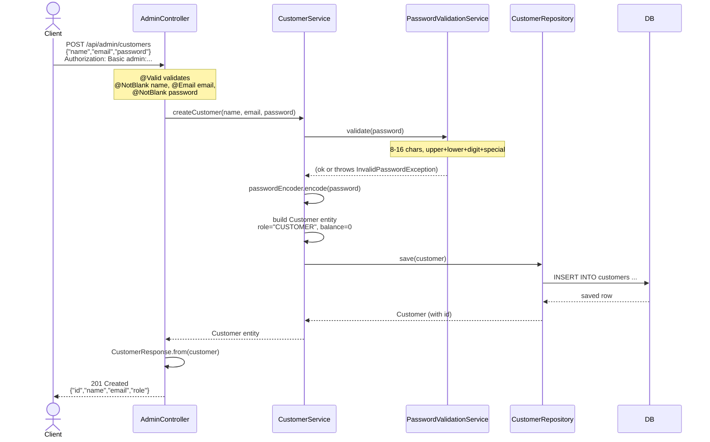
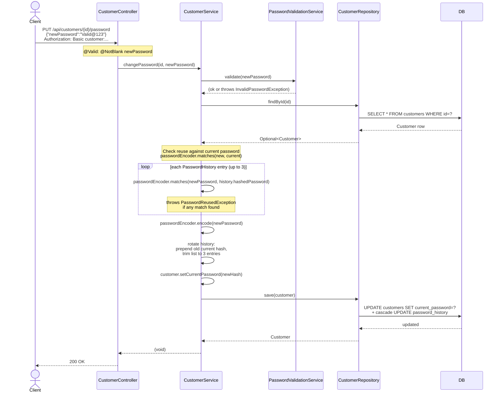
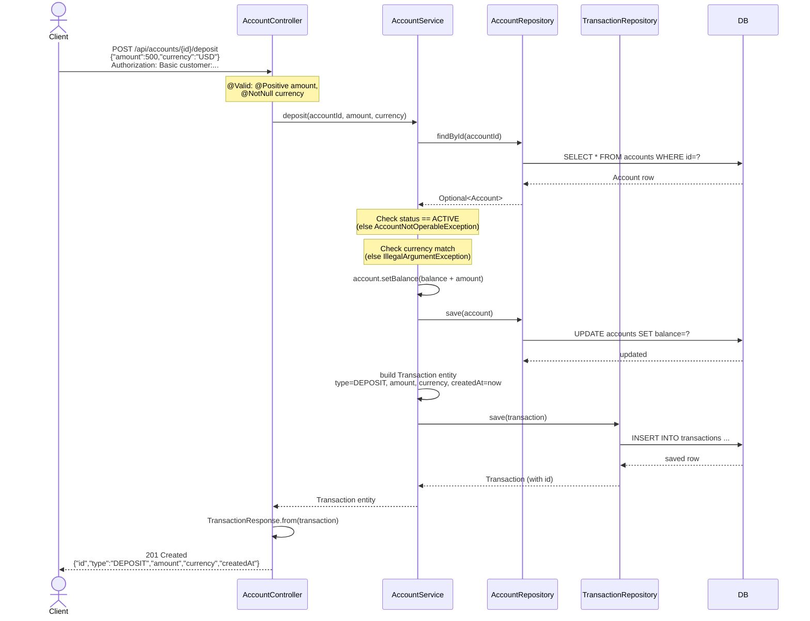
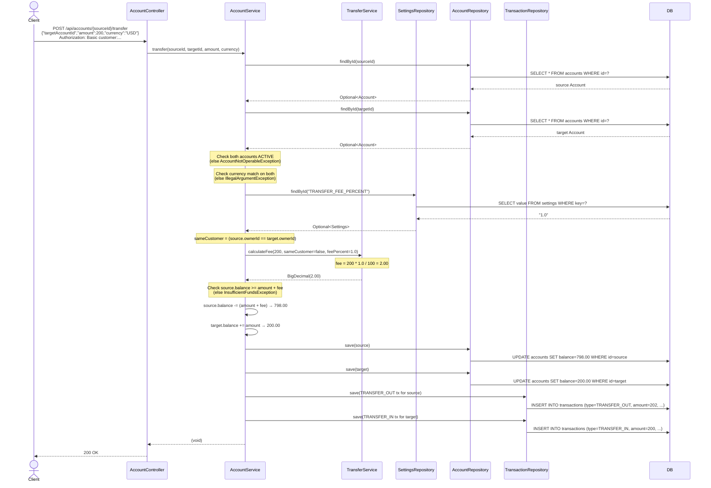
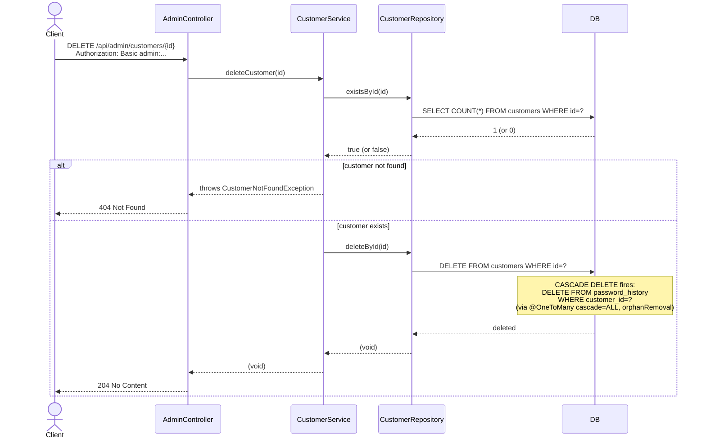
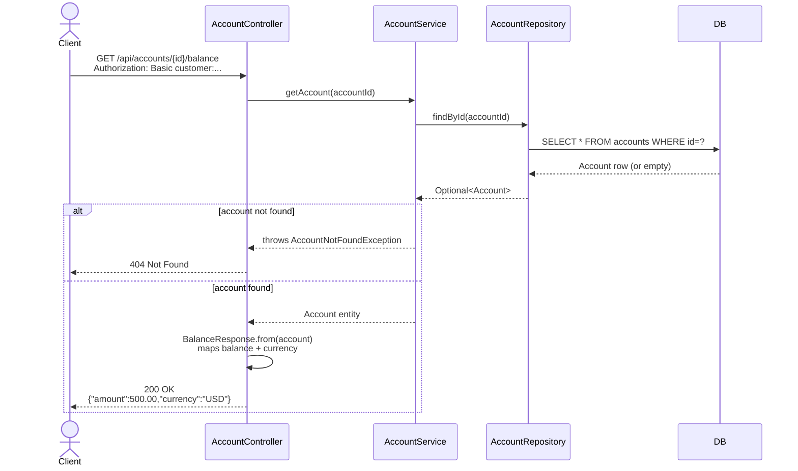
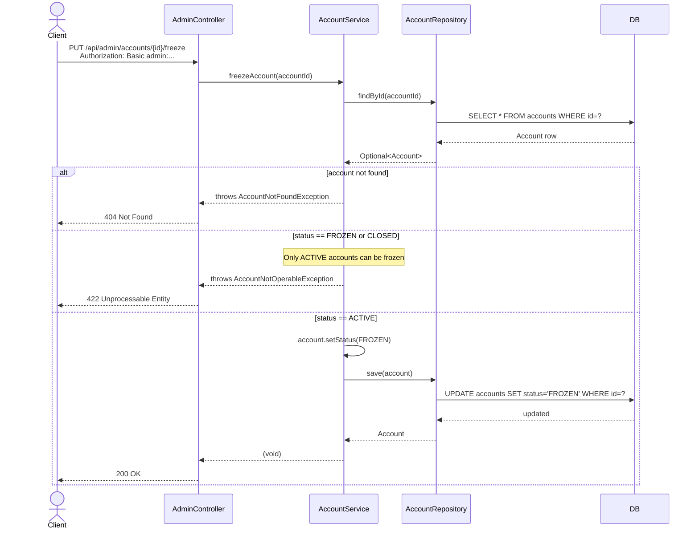

# Flows — Ayvalık Bank LA-1

Sequence diagrams for the 7 key use cases. Each diagram shows the full call chain from the HTTP client through the layered stack to the database and back.

Actors used in all diagrams:
- **Client** — HTTP caller (curl, browser, integration test)
- **Controller** — the Spring MVC controller that receives the request
- **Service** — the Spring service that contains the business logic
- **Repository** — the Spring Data JPA repository interface
- **DB** — the underlying PostgreSQL / H2 database

---

## 1. CreateCustomer (Admin creates a customer)



---

## 2. ChangePassword (Customer changes their password)



---

## 3. Deposit (Customer deposits money into an account)



---

## 4. Transfer (Cross-customer transfer with fee)



---

## 5. DeleteCustomer (Admin deletes a customer)



---

## 6. GetBalance (Customer checks account balance)



---

## 7. FreezeAccount (Admin freezes an account — state machine)



---

## State Machine Reference

```
              ┌──────────┐
  open()      │          │  freeze()
─────────────►│  ACTIVE  │──────────────┐
              │          │              │
              └────┬─────┘              ▼
                   │             ┌──────────────┐
                   │  close()    │    FROZEN    │
                   │    ┌────────│              │
                   │    │        └──────┬───────┘
                   │    │               │ unfreeze()
                   │    │               │
                   ▼    ▼               │
              ┌──────────┐             │
              │  CLOSED  │◄────────────┘
              │ (terminal)│  close()
              └──────────┘
```

Valid transitions:
- `ACTIVE → FROZEN` via `freeze()`
- `FROZEN → ACTIVE` via `unfreeze()`
- `ACTIVE → CLOSED` via `close()`
- `FROZEN → CLOSED` via `close()`
- Any attempt to transition from `CLOSED` throws `AccountNotOperableException`
- Freezing a `FROZEN` account or unfreezing an `ACTIVE` account throws `AccountNotOperableException`
